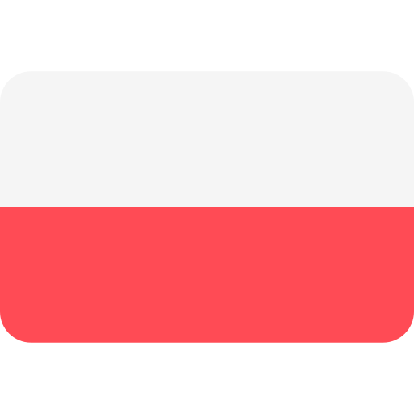

</img>

# Hi, nice to see You here! 💖

### 🐝 &nbsp;About Me

🌸 My name is Sandra and I'm from Poland. I studied at the Opole University of Technology, where I received my engineering degree with honours, and at the Poznań University of Technology, where I received my master's degree in engineering.

Thanks to my studies, I had the opportunity to come into contact with many technologies and interesting people from the world of science, which sparked my interest in IT. 🌟

During that time, I had the pleasure of taking many courses that deepened my passion and knowledge in the field of computer science. I have posted some of my work on this repository. 

✨If you find something here for yourself, feel free to use it however you want.~✨

  
<b>:computer: &nbsp;Tech knowledge</b>

   

<!-- 
Programming Languages:
C++, C#, Java, Python;\
Version Control & DevOps Tools:
GitHub, GitLab, Docker;\
IDEs:
VSCode, Eclipse, IntelliJ IDEA;\
Database Management Systems:
postgresql, mysql, sqlite, oracle;\
Architectural Patterns:
clean architecture, mvc, mvvm;\
Web Development Languages:
HTML5, CSS, JavaScript, TypeScript;\
basic linux;\
-->
  
  Programming Languages:\
  &nbsp;
  &nbsp;
  
  &nbsp;
  
  Frameworks:\
  &nbsp;
  &nbsp;
  &nbsp;
  
  ML/DL:\
  
  
  
  
  
  Version Control & DevOps Tools:\
  &nbsp;
  &nbsp;
  &nbsp;

  IDEs:\
  &nbsp;
  &nbsp;
  &nbsp;
  &nbsp;
  &nbsp;
  &nbsp;
  
  Database Management Systems:\
  &nbsp;
  &nbsp;
  &nbsp;
  
  Graphics:\
  &nbsp;
  &nbsp;
  &nbsp;
  &nbsp;
  &nbsp;

<!-- 
PS, XD, ILLUSTRATOR, PROCREATE,
MVC, MVVM, SCRUM, 
LINUX
-->

  
<b>🐝: &nbsp;Currently learning</b>

   
  
&nbsp;
&nbsp;
&nbsp;
&nbsp;
&nbsp;

  
<b>🧠: &nbsp;Other knowledge</b>

   
  
&nbsp;
&nbsp;

&nbsp;
&nbsp;
&nbsp;
&nbsp;

  
<b>:gear: &nbsp;GitHub Statistics</b>

   
    

        
    

    

         
    

### 🐝 &nbsp;My socials

  &nbsp;&nbsp;&nbsp;&nbsp;
  &nbsp;&nbsp;&nbsp;&nbsp;
  &nbsp;&nbsp;&nbsp;&nbsp;
  &nbsp;&nbsp;&nbsp;&nbsp;

<table align="right",>
 <td> <a href="README_pl.md">Polish Version &nbsp;</a></td>
</table>
