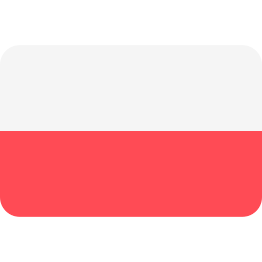

<table align="right">
 <tr><td><a href="README.md"> English</a></td></tr>
 <tr><td><a href="README_pl.md"> Polski</a></td></tr>
</table>

# Cześć, miło Cię tutaj widzieć! 💖

### 🐝 &nbsp;O mnie

🌸Nazywam się Sandra i mieszkam w Polsce. Studiowałam na Politechnice Opolskiej, gdzie z wyróżnieniem otrzymałam tytuł inżyniera i na Politechnice Poznańskiej, gdzie uzyskałam tytuł magistra.

Dzięki studiom miałam okazję zetknąć się z wieloma technologiami i ciekawymi osobami ze świata nauki, które wzbudziły we mnie zainteresowanie informatyką. 🌟

W trakcie nauki miałam przyjemność uczestniczyć w wielu kursach, które pogłębiły moje zamiłowanie i wiedzę w dziedzinie informatyki. Część mojej pracy umieściłam na tym repozytorium.  

✨Jeśli znajdziesz tu coś dla siebie, śmiało korzystaj jak tylko chcesz.~✨

  
<b>:computer: &nbsp;Moje umiejętności</b>

   

<!-- 
Programming Languages:
C++, C#, Java, Python;\
Version Control & DevOps Tools:
GitHub, GitLab, Docker;\
IDEs:
VSCode, Eclipse, IntelliJ IDEA;\
Database Management Systems:
postgresql, mysql, sqlite, oracle;\
Architectural Patterns:
clean architecture, mvc, mvvm;\
Web Development Languages:
HTML5, CSS, JavaScript, TypeScript;\
basic linux;\
-->
  
  Języki Programowania:\
  &nbsp;
  &nbsp;
  &nbsp;
  &nbsp;
  &nbsp;
  
  Frameworki:\
  &nbsp;
  &nbsp;
  &nbsp;
  
  ML/DL:\
  
  
  
  
  
  Kontrola wersji i DevOps Tools:\
  &nbsp;
  &nbsp;
  &nbsp;

  IDEs:\
  &nbsp;
  &nbsp;
  &nbsp;
  &nbsp;
  &nbsp;
  &nbsp;
  
  Systemy zarządzania bazami danych:\
  &nbsp;
  &nbsp;
  &nbsp;
  
  Grafika:\
  &nbsp;
  &nbsp;
  &nbsp;
  &nbsp;
  &nbsp;

<!-- 
PS, XD, ILLUSTRATOR, PROCREATE,
MVC, MVVM, SCRUM, 
LINUX
-->

  
<b>🐝: &nbsp;Aktualnie się uczę</b>

   
  
&nbsp;
&nbsp;\
&nbsp;
&nbsp;
&nbsp;
&nbsp;

  
<b>🧠: &nbsp;Potrafię również</b>

   
  
&nbsp;

&nbsp;
&nbsp;
&nbsp;

&nbsp;

  
<b>:gear: &nbsp;Moje statystki na GitHub</b>

   
    

        
    

    

         
    

### 🐝 &nbsp; Moje media społecznościowe:

  &nbsp;&nbsp;&nbsp;&nbsp;
  &nbsp;&nbsp;&nbsp;&nbsp;
  &nbsp;&nbsp;&nbsp;&nbsp;
  &nbsp;&nbsp;&nbsp;&nbsp;
  <!--
  &nbsp;&nbsp;&nbsp;&nbsp;
  
  -->

